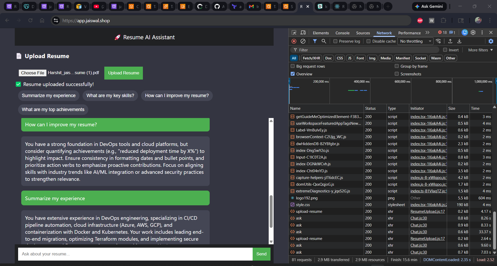
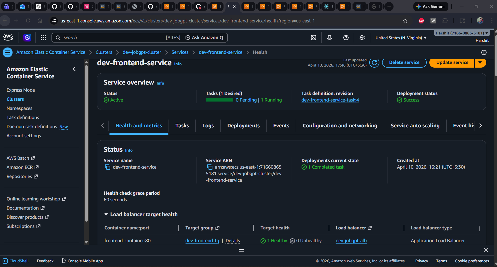
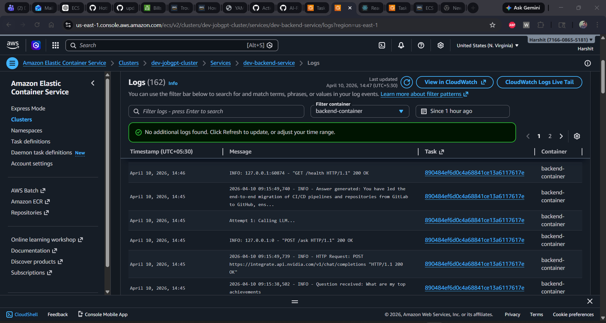
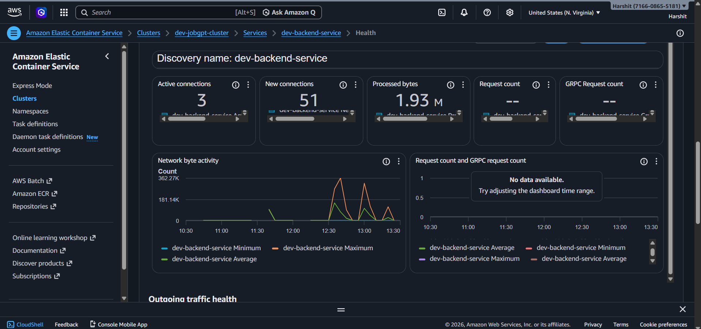

#  JobGPT Resume AI

An AI-powered resume assistant that lets you interact with your resume like ChatGPT.

---

## 🚀 UI Preview



## 🚀 Console Preview with ALB



## 🚀 Backend LOGS



## 🚀 Backend Metric




##  Overview

JobGPT Resume AI is a full-stack application that:

* Parses your resume (PDF)
* Uses an LLM to understand your experience
* Answers questions based on your resume
* Provides a ChatGPT-like interface for interaction

---

##  Features

* 📄 Resume Upload & Parsing
* 🤖 AI-powered Q&A using LLM (NVIDIA / OpenAI compatible)
* 💬 ChatGPT-style UI
* ⚡ FastAPI backend
* 🎯 Context-aware responses from your CV
* 🔐 Secure API key handling using `.env`

---

##  Tech Stack

**Frontend:**

* React.js
* Axios
* CSS (custom UI)

**Backend:**

* FastAPI
* Python
* pdfplumber (resume parsing)
* OpenAI SDK (NVIDIA API compatible)

---

## 📁 Project Structure

```
jobgpt/
├── backend/
│   ├── main.py
│   ├── llm.py
│   ├── parser.py
│   ├── requirements.txt
│
├── frontend/
│   ├── src/
│   ├── package.json
│
├── docker-compose.yml
├── README.md
```

---


### 🔧 Backend Setup

```bash
cd backend

# Create virtual environment
python -m venv venv

# Activate (Windows)
venv\Scripts\activate

# OR (Git Bash)
source venv/Scripts/activate

# Install dependencies
pip install -r requirements.txt
```

---

### 🔐 Environment Variables

Create a `.env` file inside `backend/`:

```
NVIDIA_API_KEY=your_api_key_here
```

---

### ▶️ Run Backend

```bash
python -m uvicorn main:app --reload
```

Backend will run on:

```
http://127.0.0.1:8000
```

---

### 💻 Frontend Setup

```bash
cd frontend

npm install
npm start
```

Frontend will run on:

```
http://localhost:3000
```

---


## 🤝 Contributing

Contributions are welcome!
Feel free to fork the repo and submit a PR.

---

## 📄 License

This project is licensed under the MIT License.

---

## 👨‍💻 Author

**Harshit Jaiswal**

---

⭐ If you like this project, give it a star!
